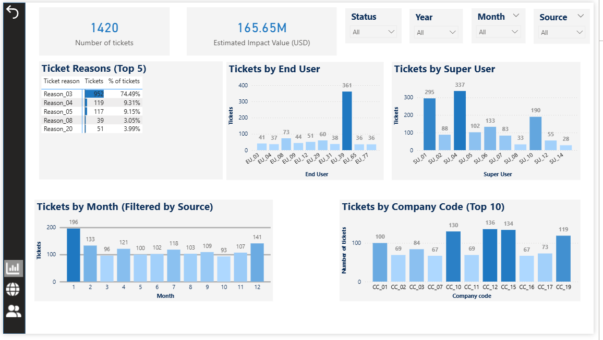
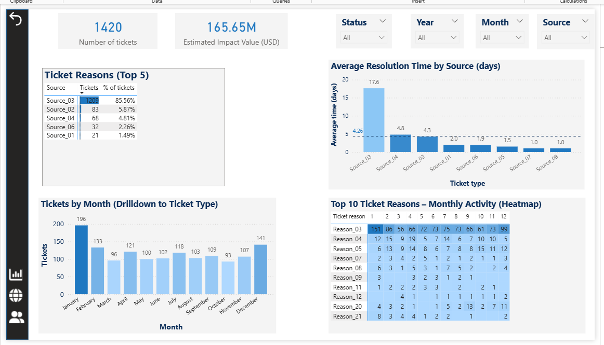
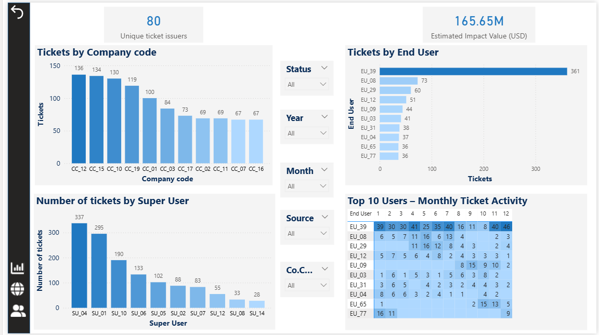

# FinOps Technical Integrity Dashboard

## 📊 Project Overview
This dashboard was developed to monitor and analyze technical friction within operational and financial processes. It tracks critical issues reported by internal teams, such as **reconciliation discrepancies**, **missing data batches**, and **system interface failures**. 

The tool provides data-driven insights into system reliability and team workload, allowing management to identify root causes of operational blockers.

**Data Privacy:** All data has been anonymized and neutralized for portfolio demonstration purposes.

## 🚀 Key Operational Insights
* **System Friction Analysis:** Identifying which software or interface generates the highest volume of errors (e.g., missing batches or data drops).
* **Reconciliation Integrity:** Tracking discrepancies between systems to ensure financial data consistency.
* **Workload & User Impact:** Analyzing which specific users (**End Users** and **Super Users**) are most affected by system issues and identifying the top reporters of technical blockers.
* **Company Code Performance:** Highlighting which entities (`Company code`) are most impacted by technical glitches to prioritize support.

## ⚙️ Advanced Analytics (DAX Measures)
The report utilizes a dedicated `Measures_table` with advanced DAX logic to provide dynamic insights:
* **Dynamic Rankings:** Implementation of `CompanyCodeRank`, `SU Rank`, and `User Rank` to automatically surface the most critical entities.
* **Contextual Percentages:** `Pct of Tickets` measures calculate the share of specific issues within the current filter context.
* **Performance Tracking:** `AVG resolution time (days)` monitors the efficiency of the technical support in resolving reported system blockers.

## 🛠 Tech Stack
* **Power BI:** Data modeling and interactive visualization.
* **DAX:** Advanced analytical formulas and ranking logic.
* **Power Query:** Data transformation and cleaning of raw operational logs.

## 📈 Dashboard Preview
### 1. Operations Summary

*High-level overview of ticket volume, impact value, and Top-N analysis of reasons.*

### 2. System & Source Analysis

*Deep dive into resolution times by source and monthly activity heatmaps.*

### 3. User & Workload Deep Dive

*Detailed analysis of individual user activity (End Users vs Super Users) and ticket distribution by Company Code.*

## 📁 Files in Repository
* `FinOps_Technical_Integrity_Dashboard.pbix`: The full interactive Power BI report.
* `README.md`: Project documentation.
